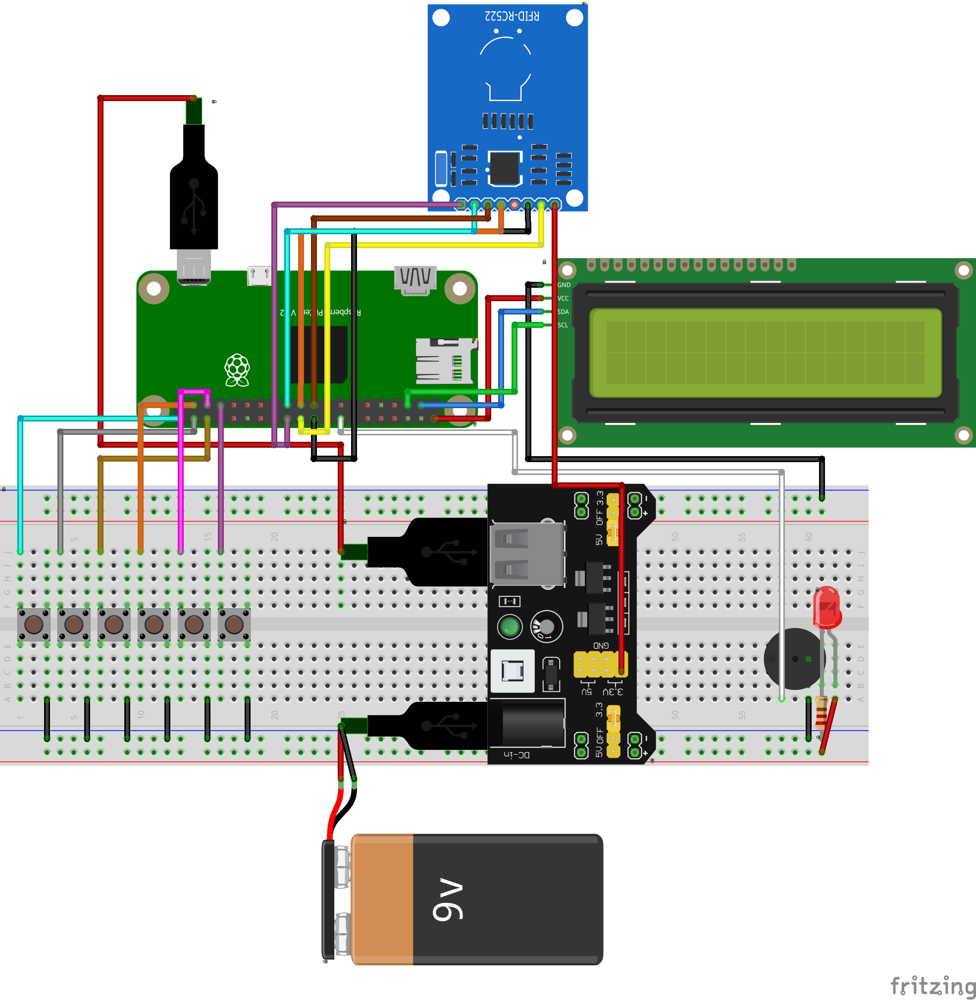

# Ez itt a Coffee+ projekt dokumnetációja

## Bekötési rajz

### A pinek bekötési rendje
RFID

    SDA → 24    
    SCK → 23
    MOSI → 19
    MISO →  21
    GND → táp
    RST → 22
    3.3v → táp

Buzzer

    pin 16

Buttons

    pin 40,
    pin 38,
    pin 36,
    pin 37,
    pin 35,
    pin 33,
    
Minden eszköz GND lábát a GND line-ra kötjük a tápegységen

Egy Led be van kötve, ellenállással csak az áramkörbe, hogy tudjuk hogy az eszköz áram alatt van.

I2C Display

    GND → táp
    VCC → táp
    SDA → pin 3
    SCL → pin 5

# Kódok dokumentációja és működése

A rendszer működése a Coffe-/src/main.py néven található meg

Ezt lefuttatva elindítunk egy backendet, amely megjeleníti a számunkra szükséges weblapokat, amikor azokra kliensrequest érkezik. A weblapok dokumentációja egy másik fájlban [Weblapdokumentáció](documentation.md) található.

A hardwert egy raspberry pi élteti, amelynek működési leírása alább látható.

1. RFID inputra várakozás
2. Ha ez megtörténik, megtörténik a user checkelése a rendszerben, ha megtalálható, folytathatja a kávévásárlását, különben letiltó hangjelzés után, visszaállunk az első állapotra.
3. A kávévásárláshoz szükséges információt kapjuk a kijelzőn, ez a kávé típusa és az ára.
4. A gombnyomásra várakozik a rendszer.
5. A gombnyomás után történik egy check hogy a felhasználónak van-e elég pénze, ha nincs, akkor letiltó hang után kér egy másik gombnyomást a felhasználótól a gép.
6. Ha van, folytatódik a vásárlás, a kávé megvétele bekerül a log-ba amit egy adatbázisban találhatunk, illetve megtörténik a pénzlevonás is a usertől.
7. visszatérünk az első állapotba.

A scriptek lényeges leírása:

### main.py

    A program és weblap futásához szükséges indításokat végzi el, illetve elkezdi az RFID adatok olvasását is.

### beep.py
    
    A csipógóért felelős script. Olyan funkciókat tartalmaz amelyek bizonyos frekvencián megszólaltatják a csipogót, például success és denied hangok.

### button.py

    A gombnyomásokért felelős script. Funkciói ellenőrzik a gombnyomásokat, és meghívják a szükséges funkciókat (ilyenek például a sikeres vásárláskor a success hang és a kávé loggolása, pénz elvétele a felhasználótól).

### display.py

    A 2 soros 16 karakteres kijelzőért felelős script. Funkciói között található a különböző user felhívásra irányuló megjelenítő feladatok.
    Itt találhatóak a kávé nevek és árak kiírásáért felelős sorok is.

### read.py

    Az RFID olvasóért felel. Csakis annyi feladata van hogy olvassa az RFID kártyát, majd az id-ját visszaküldje.

### readdata.py

    Az összes adatbázisból való olvasásért és adatbázisba való írásért felelős script. Teljesen hozzáfér az adatbázis tábláihoz, amelyet a python script az sqlite3 modul importálásával képes módosítani. A módosítások egy oldalfrissítéssel láthatóak is az admin és a felhasználói oldalon is.
    A script képes új felhasználó hozzáadására, a pénz hozzáadására adott felhasználóhoz, a barchart létrehozásához szükséges adatokat lekérésére, a jelszavakat elérésére és ellenőrzésére, ellenőrizni a felhasználó szerepelését az adatbázisban, a gombok mögötti kávék olvasására, a megfelelő mennyiségű pénz ellenőrzésére,

### app.py

    A backendje a weblapoknak. Különböző routok vannak meghatározva a felhasználói bejelentkezés ellenőrzésére, az oszlopdiagram adatok kérésére és kiírására, a felhasználók és felhasználói pénzek hozzáadására is.

# Továbbfejlesztési lehetőségek

A projektet tovább lehetne több oldalról is fejleszteni, hiszen jelenleg nagyon sok dolgot csak az az admin/rendszergazda tud változtatni, aki hozzáfér az adatbázishoz is.

Egyrészt mindenképpen lehetne a weboldalakat designolni, de ez csak szépségi szempontból lehetne hasznosabb.

A weboldalakon, ahol grafikont rajzolunk ki, ott mindenképpen lehetne több fajta leosztásban is látni az adatokat, például azt hogy ne csak az utolsó 7 nap adatait lássuk.

Mindenképpen lehetne a biztonságon is növelni, ha nem a születési évszámokat használnánk jelszónak, hanem valamilyen hash alapú jelszó kódolást csinálnánk.

Egy összeforrasztott alaplapra lehetne az eszközt összerakni, amelyel sokkalta tartósabbá lehetne tenni.
Emellett lehetne neki egy 3D nyomtatott házat is készíteni, amivel még stabilabb lenne a tároló doboz.
E kettő kombinálásával pedig még kisebbé is át lehetne alakítani a hardvert.

Az adminfelületbe lehetne egy kávé állítás funkciót beiktatni, ahol meg lehetne változtatni hogy melyik gomb mögött melyik kávé van.
Egy olyan funkciót is hozzá lehetne az adminokhoz adni, hogy tudjanak kitörölni felhasználókat az adatbázisból.

A raspberry pi-on megoldani hogy egyrészt automatikusan induljon el a jelenlegi kávérögzítő program, illetve még mindenképpen előnyös lenne ha a raspberrypi-tól lehetne localhostolni az adatbázist, amelyet elérhetnénk valamilyen helyi hálózati, akár netes grafikus felületről.

Lehetne az eszközhöz egy stabilabb áramforrást kapcsolni, illetve hűtőlapkát a processzorra és a memóriára is, mert úgy vélem emiatt képes hosszabb futás után túlmelegedni, és ettől fogva nem reagálni, semmilyen funkcióra.

A végtermékként meg az eszközt lehetne egy kávéfőzőn belülre rakni, amit egy relén keresztül ki-be tudna kapcsolgatni, hogy főzze a kávét.